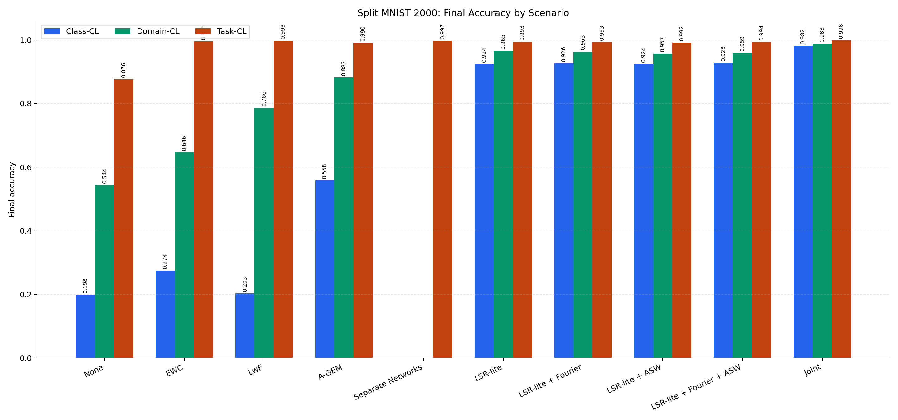
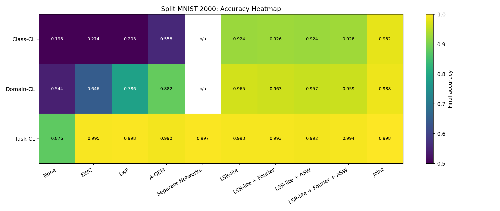
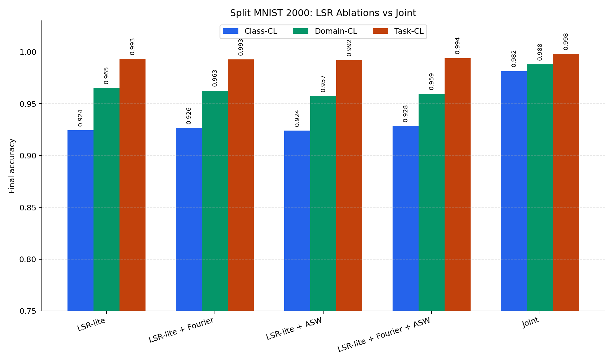
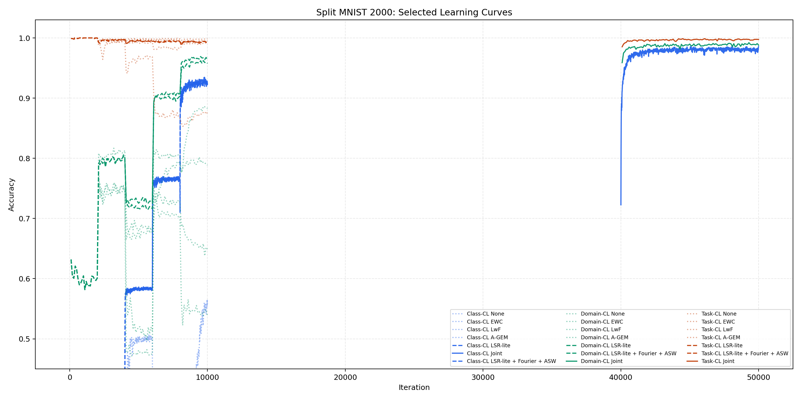
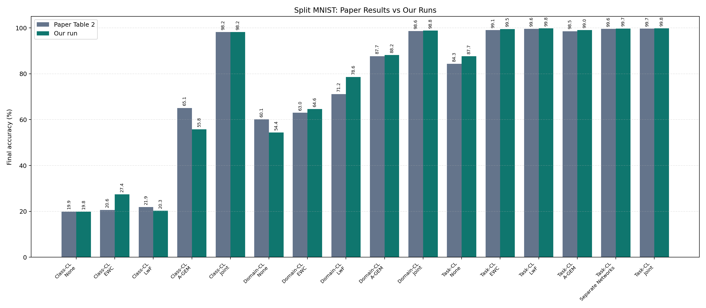

# Split MNIST Continual Learning Report

This repository contains a static GitHub Pages report for the Split MNIST continual-learning experiments.

Website, after GitHub Pages is enabled:

`https://tonagame.github.io/splitmnist-continual-learning-report/`

The report is written in Hebrew and summarizes experiments comparing:

- None
- EWC
- LwF
- A-GEM
- Separate Networks
- Generative Classifier, where supported
- LSR-lite
- LSR-lite + Fourier
- LSR-lite + ASW
- LSR-lite + Fourier + ASW
- Joint Training

## What Is Included

- `index.html` - the main Hebrew report page
- `styles.css` - page styling
- `assets/` - graphs, CSV summary, and Word report
- `code/` - experiment scripts and LSR-lite prototype code
- `CODE_EXPLANATION.md` - detailed explanation of the code and algorithms
- `METHODS_IMPLEMENTATION.md` - what was implemented by us vs reused from the original repository
- `PAPER_COMPARISON.md` - comparison between the paper's Split MNIST results and our local results
- `takeaways.md` - reflective writing / project takeaways
- `VIDEO.md` - short video checklist and placeholder link
- `assets/summary_hebrew_splitMNIST_2000.docx` - Hebrew Word report
- `assets/splitMNIST_2000_all_scenarios_summary.csv` - combined result table

## Assignment Checklist

This repository includes the required project documentation:

- **Algorithmic thinking:** explained in the website and in `takeaways.md`.
- **Project steps:** setup, baseline runs, selected methods, LSR-lite prototype, final 2000-iteration phases, graphs, and report.
- **Testing at each stage:** smoke tests, CUDA checks, 100-iteration runs, 2000-iteration serious runs, final full-test evaluation, and learning-curve logging.
- **Output conclusions:** summarized in the website, README, Word report, graphs, and CSV.
- **AI links / AI usage:** documented below and in the website.
- **Reflective writing:** `takeaways.md`.
- **Video link:** see `VIDEO.md`. Replace the placeholder with a YouTube or similar video link after recording.

## Where Are The Graphs?

The graph files are inside the `assets/` folder:

- `assets/all-methods-by-scenario.png`
- `assets/accuracy-heatmap.png`
- `assets/lsr-ablation-by-scenario.png`
- `assets/selected-learning-curves.png`
- `assets/paper_vs_ours_splitMNIST_common_methods.png`

They are also embedded directly in the website.

### All Methods By Scenario

### Accuracy Heatmap

### LSR Ablation By Scenario

### Selected Learning Curves

### Paper Results Vs Our Results

The comparison uses Table 2 from van de Ven, Tuytelaars & Tolias, "Three types of incremental learning".
The paper reports mean +/- SEM over 20 seeds, while our numbers are single local runs, so this is an approximate comparison rather than a full statistical reproduction.

Detailed comparison:

- `PAPER_COMPARISON.md`
- `assets/paper_vs_ours_splitMNIST_common_methods.csv`

## Where Is The Code?

The code added for this project is in:

`code/`

Important files:

- `code/train_lsr_lite.py` - the experimental LSR-lite method.
- `code/run_phase1_splitmnist_class_2000.ps1` - Class-CL 2000 runner.
- `code/run_phase2_splitmnist_domain_2000.ps1` - Domain-CL 2000 runner.
- `code/run_phase3_splitmnist_task_2000.ps1` - Task-CL 2000 runner.
- `code/phase1_summarize.py` - Class-CL summary and graph generator.
- `code/phase2_summarize.py` - Domain-CL summary and graph generator.
- `code/phase3_summarize.py` - Task-CL summary and graph generator.
- `code/patches/eval_history_and_options.patch` - patch for the original repository.

Detailed explanation:

`CODE_EXPLANATION.md`

Short code README:

`code/README.md`

The code folder does **not** include datasets, raw training outputs, Conda environments, or the full original repository.

## Did We Implement All Methods From Scratch?

No.

The classic methods were already implemented in the original GMvandeVen repository.
We ran them using the official code and command-line flags.

Reused from the original repository:

- None
- Joint Training
- EWC
- LwF
- A-GEM
- Separate Networks
- Generative Classifier where supported

Implemented in this project:

- LSR-lite
- LSR-lite + Fourier
- LSR-lite + ASW
- LSR-lite + Fourier + ASW
- learning-curve CSV logging
- phase runners
- summary and graph scripts
- website and report files

Full explanation:

`METHODS_IMPLEMENTATION.md`

## Main Result Summary

| Scenario | None | Best non-Joint method | Joint |
|---|---:|---:|---:|
| Class-CL | 0.1982 | LSR-lite + Fourier + ASW: 0.9284 | 0.9815 |
| Domain-CL | 0.5435 | LSR-lite: 0.9651 | 0.9879 |
| Task-CL | 0.8765 | LwF: 0.9978 | 0.9981 |

## Main Conclusion

LSR-lite is most promising for the hardest setting: Class-Incremental Learning without task identity.

The core useful mechanism was:

- real replay samples from train data
- labels
- stored teacher logits
- stored penultimate feature vectors
- replay cross entropy
- logit distillation
- feature anchoring

Fourier and ASW were useful as ablations, but they were not the main reason the method worked.

## Algorithmic Thinking

The project is based on the idea that continual learning is not only about fitting the current data.
The model must balance two competing goals:

1. **Plasticity:** learn the new context.
2. **Stability:** avoid forgetting old contexts.

The algorithms tested here solve this tension in different ways:

- EWC protects important parameters.
- LwF preserves old model behavior through distillation.
- A-GEM uses a memory buffer to constrain gradient updates.
- Separate Networks avoids interference by using one network per task.
- LSR-lite stores real old examples plus teacher signals and feature anchors.

## Project Stages

1. Set up Python, Conda, CUDA PyTorch, and the GMvandeVen repository locally.
2. Verified GPU execution on an NVIDIA RTX 3070.
3. Ran small Split MNIST smoke tests.
4. Ran 100-iteration baseline and selected-method experiments.
5. Implemented LSR-lite as a separate prototype without rewriting the original repository.
6. Added optional Fourier and ASW ablations.
7. Audited the protocol: no test data in training, fair buffer budget, correct Class-CL and Task-CL evaluation.
8. Ran serious 2000-iteration experiments for Class-CL, Domain-CL, and Task-CL.
9. Generated final graphs, CSV summaries, Word report, and this GitHub Pages website.

## Testing And Validation

- Smoke tests were run before long experiments.
- CUDA availability and GPU identity were checked.
- Evaluation history was logged during training.
- Final accuracy was evaluated on the full test set.
- Class-CL was evaluated without task identity.
- Task-CL kept the repository's original allowed-classes protocol.
- A-GEM and LSR-lite used the same memory budget: 100 samples per class.
- If a method failed, the runner continued and the failure was recorded.

## AI Usage

AI assistance was used to help with setup, scripting, debugging, documentation, and report generation.

- OpenAI ChatGPT / Codex: https://chatgpt.com/
- GitHub Pages documentation: https://docs.github.com/en/pages
- Original continual-learning repository: https://github.com/GMvandeVen/continual-learning

## How To Enable GitHub Pages

Because this repository already has `index.html` at the repository root, use the root folder:

1. Open the repository on GitHub.
2. Go to `Settings -> Pages`.
3. Under `Build and deployment`, choose `Deploy from a branch`.
4. Choose branch `main`.
5. Choose folder `/ root`.
6. Click `Save`.

GitHub will publish the site after a short build.

## Notes

This repository contains only the static report site.
It does not include the full training code, datasets, Conda environment, or raw experiment folders.
