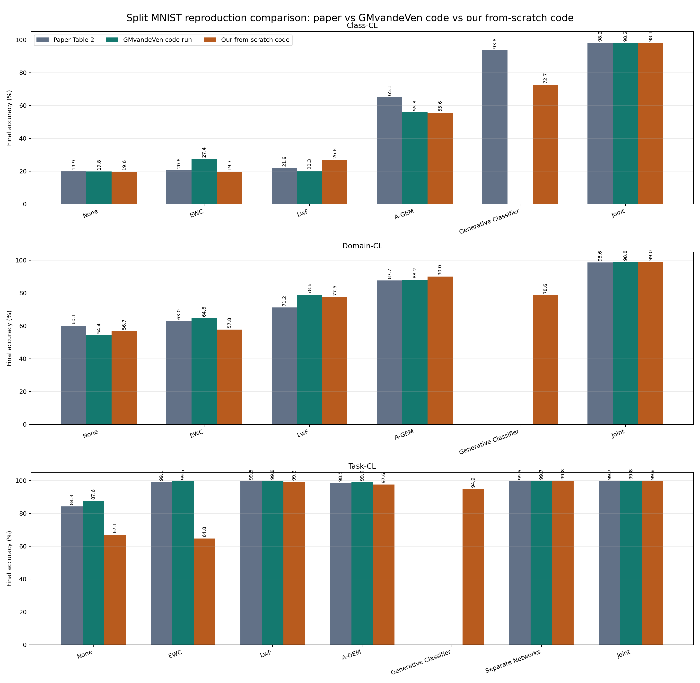

# Split MNIST Continual Learning Reproduction

This repository is the cleaned submission package for our project on catastrophic forgetting and continual learning with Split MNIST.

It contains a GitHub Pages report, graphs, result tables, and a clean-room PyTorch implementation of the methods we tested. The original GMvandeVen repository was used as a reference target, but the submission code is under `code/from_scratch/`.

Website after GitHub Pages is enabled:

`https://tonagame.github.io/splitmnist-continual-learning-report/`

## Start Here

| File / folder | Purpose |
|---|---|
| `index.html` | Main Hebrew GitHub Pages report. |
| `code/from_scratch/` | Independent PyTorch implementation for the assignment. |
| `docs/PROJECT_SCOPE.md` | What we reproduced, what we did not fully reproduce, and why. |
| `docs/REPRODUCTION_REPORT.md` | Main paper-vs-reference-vs-our-code result summary. |
| `docs/IMPLEMENTATION_AUDIT.md` | Honest status check of the implementation and limitations. |
| `docs/LSR_LITE_EXPLANATION.md` | Explanation of LSR-lite, Fourier, ASW, and the ablations. |
| `assets/` | Graphs, CSV files, and the Hebrew Word report. |

## Main Graphs

The most important comparison graph is:

Other useful figures:

- `assets/all-methods-by-scenario.png`
- `assets/accuracy-heatmap.png`
- `assets/lsr-ablation-by-scenario.png`
- `assets/selected-learning-curves.png`
- `assets/from_scratch_classic_no_lsr_2000_final_accuracy.png`
- `assets/from_scratch_classic_no_lsr_2000_learning_curves.png`

## What Was Implemented

The clean-room implementation in `code/from_scratch/` is split into a small CLI
entry point, shared core utilities, and method-specific files under
`code/from_scratch/methods/`. It includes:

- Split MNIST construction
- Class-CL, Domain-CL, and Task-CL evaluation protocols
- None / sequential fine-tuning
- Joint Training
- EWC
- LwF
- A-GEM
- Separate Networks for Task-CL
- a simple Generative Classifier
- LSR-lite
- LSR-lite + Fourier
- LSR-lite + ASW
- LSR-lite + Fourier + ASW
- CSV logging and graph aggregation

Important: the older scripts in `code/` are kept for transparency from the earlier reference-run phase. The assignment-compliant implementation is `code/from_scratch/`.

## Result Files

- `assets/paper_vs_gmvandeven_vs_from_scratch.csv`
- `assets/from_scratch_classic_no_lsr_2000_summary.csv`
- `assets/splitMNIST_2000_all_scenarios_summary.csv`
- `assets/summary_hebrew_splitMNIST_2000.docx`

## Documentation

- `docs/README.md` - documentation index
- `docs/PROJECT_SCOPE.md` - project boundaries and chosen paper
- `docs/REPRODUCTION_REPORT.md` - summary of what the experiments showed
- `docs/CODE_EXPLANATION.md` - code and method explanations
- `docs/METHODS_IMPLEMENTATION.md` - what was implemented and what was reference-run
- `docs/PAPER_COMPARISON.md` - detailed comparison with the paper
- `docs/IMPLEMENTATION_AUDIT.md` - protocol and reproduction audit
- `docs/LSR_LITE_EXPLANATION.md` - LSR-lite explanation
- `docs/AI_WORK_LOG.md` - short log of AI-assisted work
- `docs/takeaways.md` - reflective writing
- `docs/VIDEO.md` - video checklist / placeholder

## GitHub Pages

This repository is configured as a static site from the repository root:

1. Open `Settings -> Pages`.
2. Choose `Deploy from a branch`.
3. Select branch `main`.
4. Select folder `/ root`.
5. Save.

The root must be used because `index.html` is in the repository root.
