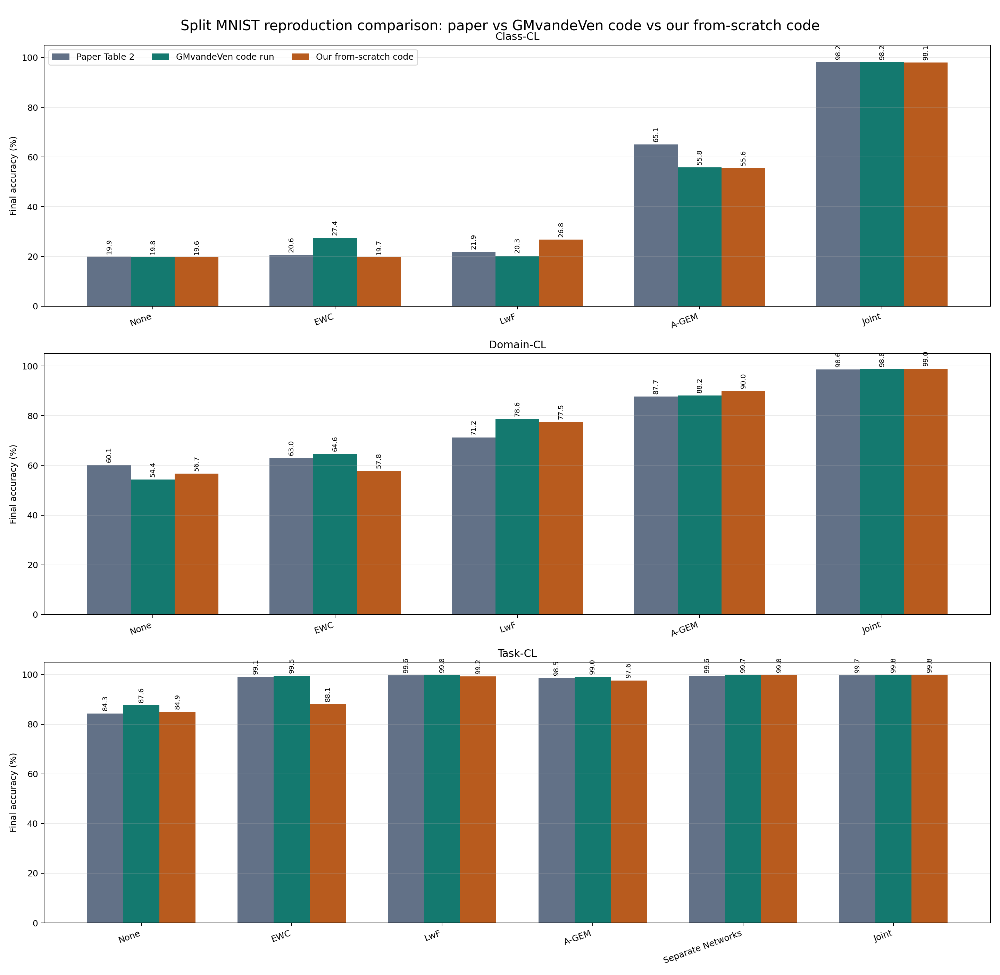

# Split MNIST Continual Learning Reproduction

This repository is the final GitHub submission package for a project on catastrophic forgetting and continual learning with Split MNIST.

It includes:

- a GitHub Pages report,
- Markdown documentation,
- clean-room Python code,
- graphs,
- CSV result files,
- reflective writing,
- AI usage documentation.

Published website after GitHub Pages is enabled:

[`https://tonagame.github.io/splitmnist-continual-learning-report/`](https://tonagame.github.io/splitmnist-continual-learning-report/)

## Submission Checklist

| Rule / requirement | Link |
|---|---|
| GitHub site includes everything | [`index.html`](index.html) |
| Algorithmic thinking | [`docs/ALGORITHMIC_THINKING.md`](docs/ALGORITHMIC_THINKING.md) |
| Project stages | [`docs/PROJECT_STEPS.md`](docs/PROJECT_STEPS.md) |
| Testing and validation by stage | [`docs/TESTING_BY_STAGE.md`](docs/TESTING_BY_STAGE.md) |
| AI documentation | [`docs/AI_DOCUMENTATION.md`](docs/AI_DOCUMENTATION.md) |
| Reflective writing / takeaways | [`docs/takeaways.md`](docs/takeaways.md) |
| Clean-room code | [`code/from_scratch/`](code/from_scratch/) |

## Main Code

The submitted implementation is:

[`code/from_scratch/`](code/from_scratch/)

Important files:

- [`splitmnist_cl.py`](code/from_scratch/splitmnist_cl.py) - command-line entry point and method dispatch.
- [`core.py`](code/from_scratch/core.py) - dataset, MLP model, replay buffer, evaluation, result writing.
- [`methods/`](code/from_scratch/methods/) - method-specific implementations.

Implemented methods:

- None / sequential fine-tuning
- Joint Training
- EWC
- LwF
- A-GEM
- Separate Networks
- LSR-lite
- LSR-lite + Fourier
- LSR-lite + ASW
- LSR-lite + Fourier + ASW

The older GMvandeVen-based scripts are kept only as historical reference files under [`code/legacy_reference/`](code/legacy_reference/).

## Main Results And Graphs

Most important comparison graph:



All graph previews are also collected in [`assets/README.md`](assets/README.md).

Other graphs:

- [`assets/all-methods-by-scenario.png`](assets/all-methods-by-scenario.png)
- [`assets/accuracy-heatmap.png`](assets/accuracy-heatmap.png)
- [`assets/lsr-ablation-by-scenario.png`](assets/lsr-ablation-by-scenario.png)
- [`assets/selected-learning-curves.png`](assets/selected-learning-curves.png)
- [`assets/from_scratch_classic_no_lsr_2000_final_accuracy.png`](assets/from_scratch_classic_no_lsr_2000_final_accuracy.png)
- [`assets/from_scratch_classic_no_lsr_2000_learning_curves.png`](assets/from_scratch_classic_no_lsr_2000_learning_curves.png)

Result files:

- [`assets/paper_vs_gmvandeven_vs_from_scratch.csv`](assets/paper_vs_gmvandeven_vs_from_scratch.csv)
- [`assets/from_scratch_classic_no_lsr_2000_summary.csv`](assets/from_scratch_classic_no_lsr_2000_summary.csv)
- [`assets/splitMNIST_2000_all_scenarios_summary.csv`](assets/splitMNIST_2000_all_scenarios_summary.csv)

## Documentation Index

- [`docs2/README.md`](docs2/README.md) - short final submission pack with the four requested documents.
- [`docs/README.md`](docs/README.md)
- [`docs/PROJECT_SCOPE.md`](docs/PROJECT_SCOPE.md)
- [`docs/REPRODUCTION_REPORT.md`](docs/REPRODUCTION_REPORT.md)
- [`docs/CODE_EXPLANATION.md`](docs/CODE_EXPLANATION.md)
- [`docs/METHODS_IMPLEMENTATION.md`](docs/METHODS_IMPLEMENTATION.md)
- [`docs/PAPER_COMPARISON.md`](docs/PAPER_COMPARISON.md)
- [`docs/IMPLEMENTATION_AUDIT.md`](docs/IMPLEMENTATION_AUDIT.md)
- [`docs/LSR_LITE_EXPLANATION.md`](docs/LSR_LITE_EXPLANATION.md)

## GitHub Pages Setup

Use:

```text
Branch: main
Folder: / root
```

The repository uses root [`index.html`](index.html), so do not choose `/docs` for GitHub Pages.
