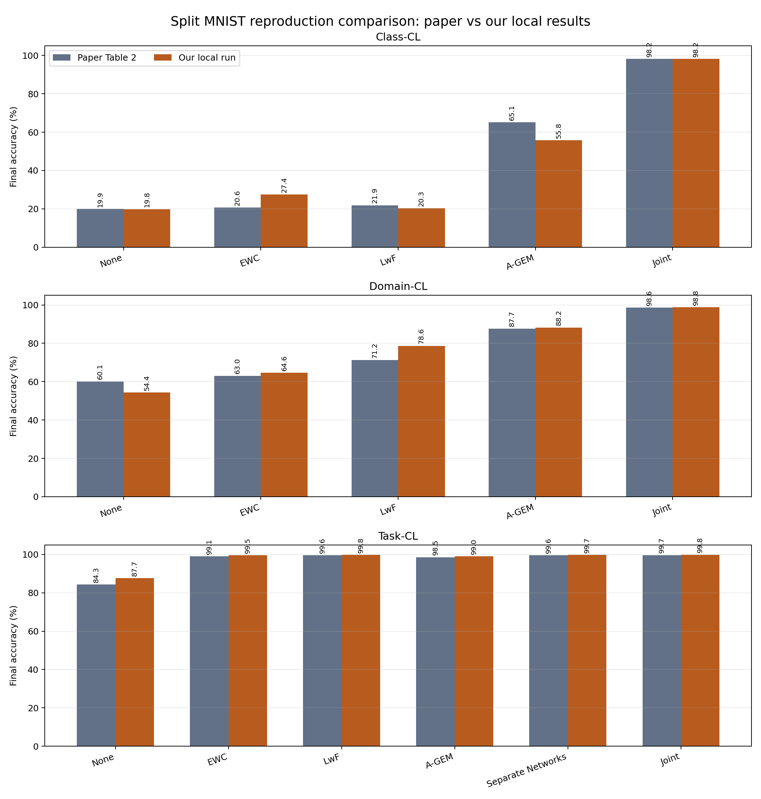
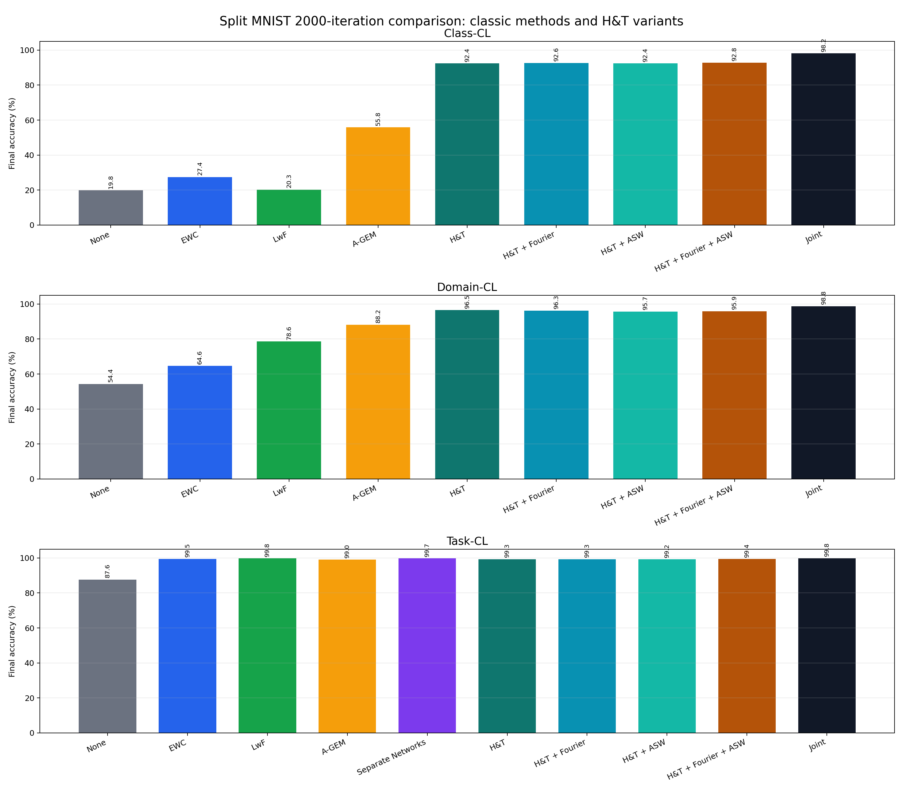
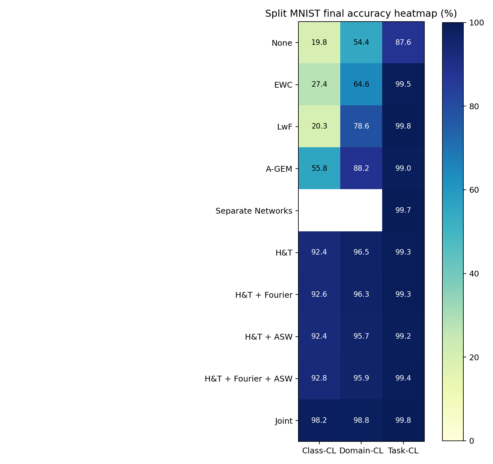
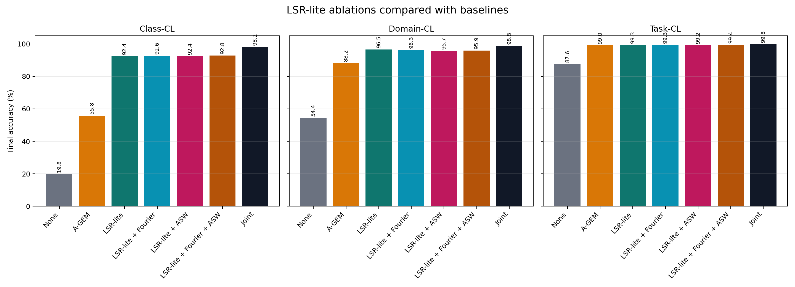
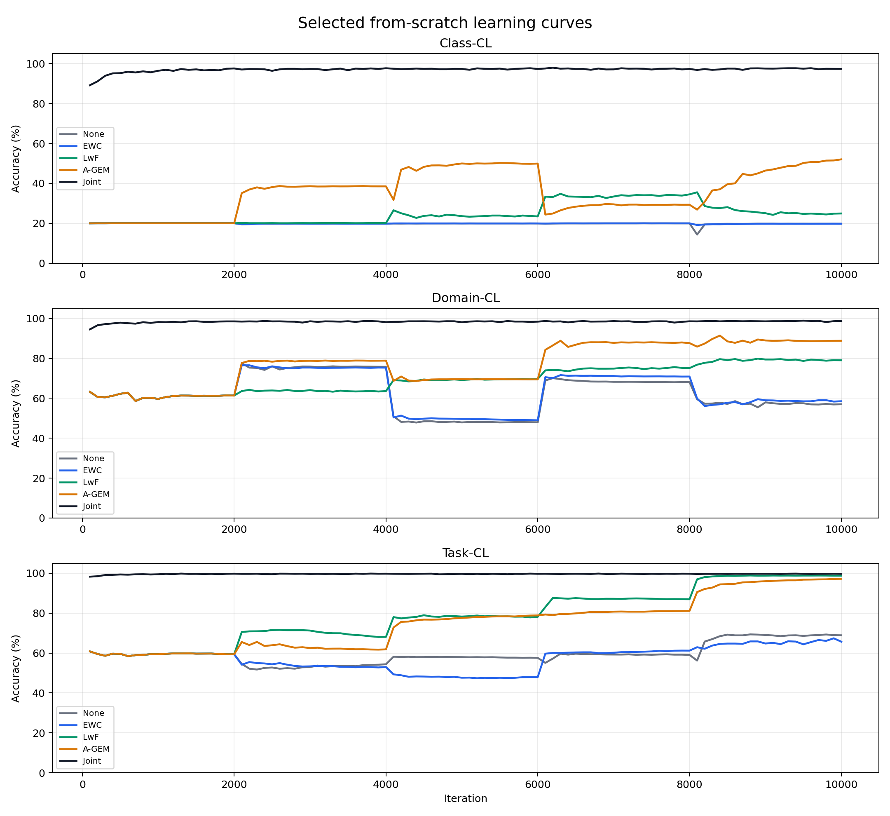
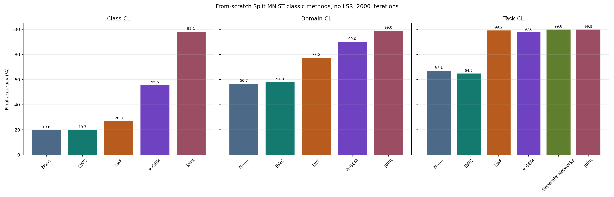
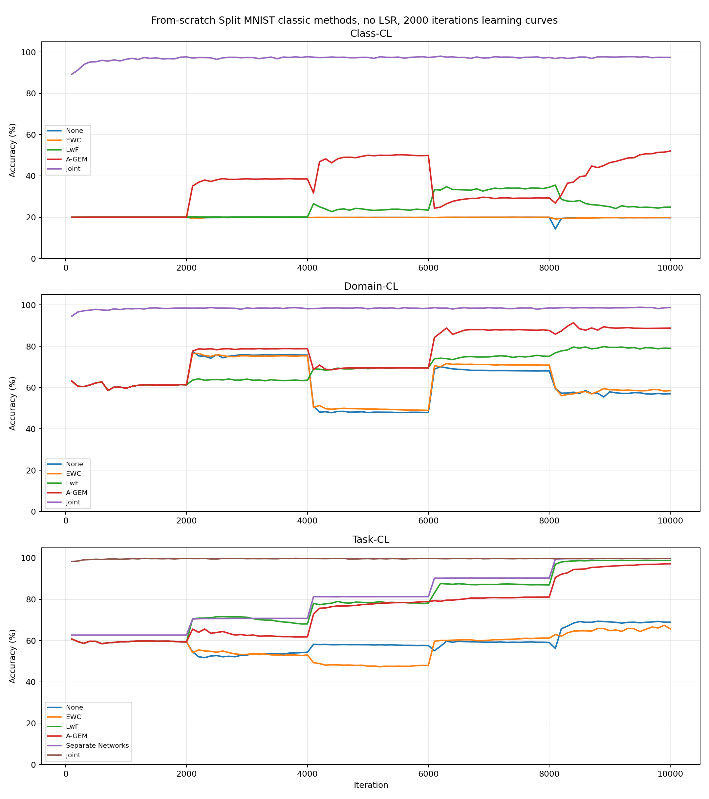

# Assets

This folder contains the project graphs, CSV result tables, and Word reports used by the GitHub Pages report.

The image previews below are intentionally kept in one place so the results can be inspected quickly from GitHub.

## Main Graphs

### Paper vs GMvandeVen vs From-Scratch

Compares the original paper numbers, the GMvandeVen repository run, and our from-scratch implementation for the shared Split MNIST methods.

### Paper vs Our Local Results

Compares the paper reference values against our local reproduced Split MNIST results for the common methods.

### All Methods By Scenario

Shows the main method comparison across Task-CL, Domain-CL, and Class-CL.

### Accuracy Heatmap

Summarizes accuracy by method and scenario in a compact heatmap view.

### LSR Ablation By Scenario

Compares LSR-lite, Fourier, ASW, and Fourier + ASW variants across the continual-learning scenarios.

### Selected Learning Curves

Shows selected learning curves over training progress.

### From-Scratch Classic Final Accuracy

Final accuracy for the from-scratch classic, non-LSR methods.

### From-Scratch Classic Learning Curves

Learning curves for the from-scratch classic, non-LSR methods.

## CSV Result Tables

- [paper_vs_gmvandeven_vs_from_scratch.csv](paper_vs_gmvandeven_vs_from_scratch.csv)
- [paper_vs_ours_splitMNIST_common_methods.csv](paper_vs_ours_splitMNIST_common_methods.csv)
- [splitMNIST_2000_all_scenarios_summary.csv](splitMNIST_2000_all_scenarios_summary.csv)
- [from_scratch_classic_no_lsr_2000_summary.csv](from_scratch_classic_no_lsr_2000_summary.csv)

## Word Reports

- [full_project_explanation_with_all_graphs.docx](full_project_explanation_with_all_graphs.docx)
- [code_explanation_full.docx](code_explanation_full.docx)
- [summary_hebrew_splitMNIST_2000.docx](summary_hebrew_splitMNIST_2000.docx)

## Notes

- The PNG files are the graph images displayed on the project page.
- The CSV files contain the numerical values used to create the graphs.
- The DOCX files are written reports for project explanation and submission support.
